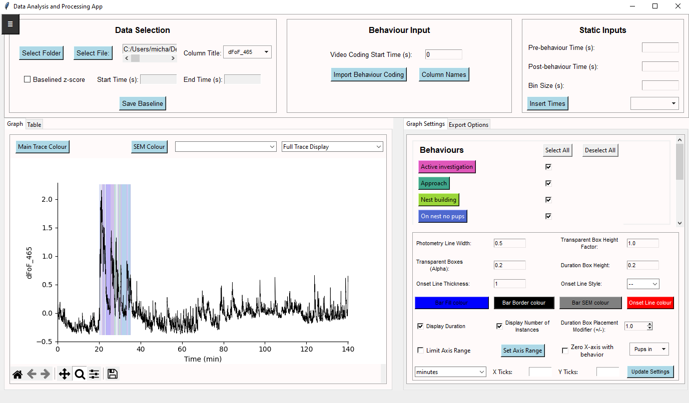
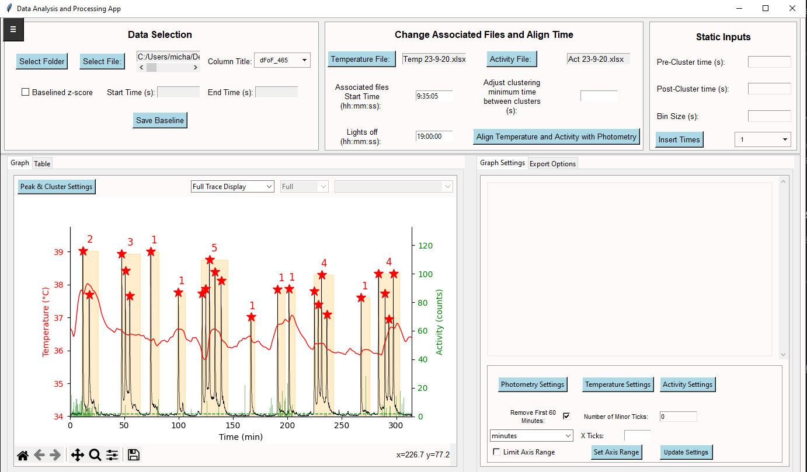

# NeuroSyncApp (Version 2.0.15)

**NeuroSyncApp**: A Photometry, Behavior, and Telemetry Alignment Tool

NeuroSyncApp is a Python tool designed for neuroscientists and researchers to align and analyze photometry, behavioral, and telemetry data in a single interface. This application facilitates visualization, AUC calculations, and data export, making it versatile for studies involving optogenetics, temperature recordings, and more.

---

## Table of Contents

- [NeuroSyncApp (Version 2.0.15)](#neurosyncapp-version-2015)
  - [Table of Contents](#table-of-contents)
  - [Prerequisites](#prerequisites)
  - [Installation](#installation)
    - [Conda Environment Setup](#conda-environment-setup)
    - [Standard Python (venv) Setup](#standard-python-venv-setup)
  - [Quick Start](#quick-start)
  - [Features](#features)
  - [How to Use](#how-to-use)
    - [Loading Data](#loading-data)
    - [Aligning Photometry and Behavior](#aligning-photometry-and-behavior)
    - [Visualizing Data](#visualizing-data)
    - [Exporting Results](#exporting-results)
  - [Configuration Options](#configuration-options)
  - [Common Tasks](#common-tasks)
  - [Example Use Cases](#example-use-cases)
    - [Use Case 1: Aligning Photometry with Nesting Behavior](#use-case-1-aligning-photometry-with-nesting-behavior)
    - [Use Case 2: Photometry with Telemetry Data Analysis](#use-case-2-photometry-with-telemetry-data-analysis)
  - [Future Additions](#future-additions)
  - [Contributing](#contributing)
  - [License](#license)

---

## Prerequisites

- Python 3.8 or higher
- `pip` or `conda` for dependency management

## Installation

### Conda Environment Setup

- Create an environment named `neuro_env` using Conda:

  ```bash
  conda create -n neuro_env python=3.8
  conda activate neuro_env
  ```

- Install the required dependencies:

  ```bash
  pip install -r requirements.txt
  ```

### Standard Python (venv) Setup

- Create a virtual environment named `neuro_env`:

  ```bash
  python -m venv venv
  ```

- Activate the environment:

  ```bash
  neuro_env\Scripts\activate
  ```

- Install the required dependencies:

  ```bash
  pip install -r requirements.txt
  ```

## Quick Start

1. **Activate the Environment**:

   ```bash
   conda activate neuro_env  # or use neuro_env\Scripts\activate
   ```

2. **Run the App**:

   ```bash
   python main_app.py
   ```

---

## Features

This app provides several powerful features designed to help you synchronize and analyze your fiber photometry and behavioral data:

| Feature                | Description                                                    |
|------------------------|----------------------------------------------------------------|
| **Data Loading**       | Supports CSV and XLSX formats                                  |
| **Behavior Synchronization** | Aligns photometry data with behaviors and can export custom time windows |
| **Binned AUC Analysis** | Calculates Area Under the Curve (AUC) in user-defined bins    |
| **Graph Customization** | Adjustable axis limits, trace colors, and gridlines           |
| **Export Options**     | Export aligned data as Excel files and images                  |
| **Advanced Plotting**  | Visualize fiber photometry data in sync with behavioral data   |
| **Configurable Settings** | Automatically saves and loads custom visualization and behavior settings that you can share with others for consistent formatting    |

---

## How to Use

### Loading Data

When you first launch the app, you'll be presented with an intuitive dashboard for aligning fibre photometry data with behavior. To get started:

1. In the **Data Selection** section, use the **Select File** button to choose your fiber photometry data file. Supported formats include `.csv` and `.xlsx`.
2. Select the column from the loaded data that contains the photometry trace you want to analyze.
3. Load a behavior coding file containing behavioral event times (e.g., actions like nest building, licking pups).

### Aligning Photometry and Behavior

1. Select the `.csv` file containing the behaviour data times to align with the photometry data in the **Behavior Input** section - *Note* you need to input the column names that contain the behavior, start time and end time on first use.
2. Specify the **Pre-Behavior** and **Post-Behavior** windows to define how much data to visualize before and after each event.
3. The app will automatically visualize the photometry data with behavior time points overlaid.

### Visualizing Data

In the **Graph Settings** tab, you can:

- Adjust X and Y axis limits to focus on specific time ranges.
- Enable/disable gridlines for easier interpretation.
- Select graph types (full trace, single row, behavior mean and SEM).
- Customize trace colors, SEM colors, and bar graph properties.

### Exporting Results

The **Export Options** tab provides choices for exporting data and visualizations:

- Export aligned data as Excel files and images in `.png`, `.svg`, `.jpg`, or `.tiff`.
- Choose metrics to export (AUC, max amplitude, mean dF/F).
- All data is exported into an xlsx with a summary page and raw data.

## Configuration Options

The app offers configuration options to adapt to different experimental setups:

- **Behavior Settings**: Customize behavior codes, colors, and sync points.
- **Graph Settings**: Adjust visualization properties such as line thickness, opacity, and axis limits.
- **Binning**: Define bin sizes (in seconds) for AUC and other metrics.
- **Time Synchronization**: Zero the X-axis relative to specific behaviors.

All configurations can be saved and loaded with the **App Settings Manager**.

## Common Tasks

- **Configuring Graphs**: Set axis ranges, trace colors, and SEM display options.
- **Visualizing Data**: Customize trace displays for full, single row, or behavior-focused views.
- **Exporting Results**: Save as Excel files or image formats.

---

## Example Use Cases

### Use Case 1: Aligning Photometry with Nesting Behavior

If studying maternal behavior, align the photometry signal with pup-orientated behavior. Load photometry and behavior data, then set pre- and post-behavior windows to examine signal fluctuations.



### Use Case 2: Photometry with Telemetry Data Analysis

Adapt the app to align photometry with telemetry physiological recordings. Files are detected automatically and are aligned using the time of day that you started the recording.



---

## Future Additions

I am excited about expanding NeuroSyncApp’s capabilities! Here are some planned features:

- **Expanded Analysis Options**:  
  Adding more analytical tools to provide deeper insights into synchronized photometry and behavior data for each recording.

- **Multi-Mouse Data Alignment**:  
  A full-featured app for aligning data from multiple mice simultaneously, ideal for generating peri-event histograms and comparing across subjects.

- **Web-Based Interface with React**:  
  Transitioning to a web app with a React-based front end for an enhanced, user-friendly interface and improved visual presentation.

Stay tuned for these and other updates as I continue to enhance NeuroSyncApp!

## Contributing

I welcome contributions! To contribute:

1. Fork the repository on GitHub.
2. Make your changes in a new branch.
3. Submit a pull request with detailed information about your changes.

Please ensure all code follows PEP8 guidelines and includes documentation.

---

## License

This project is licensed under the MIT License. See the `LICENSE` file for more details.
